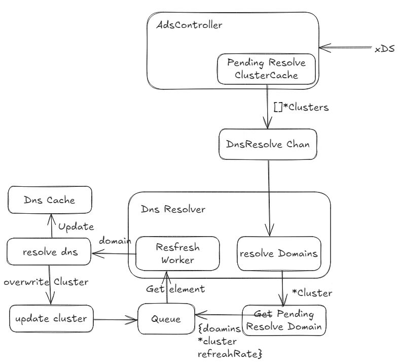
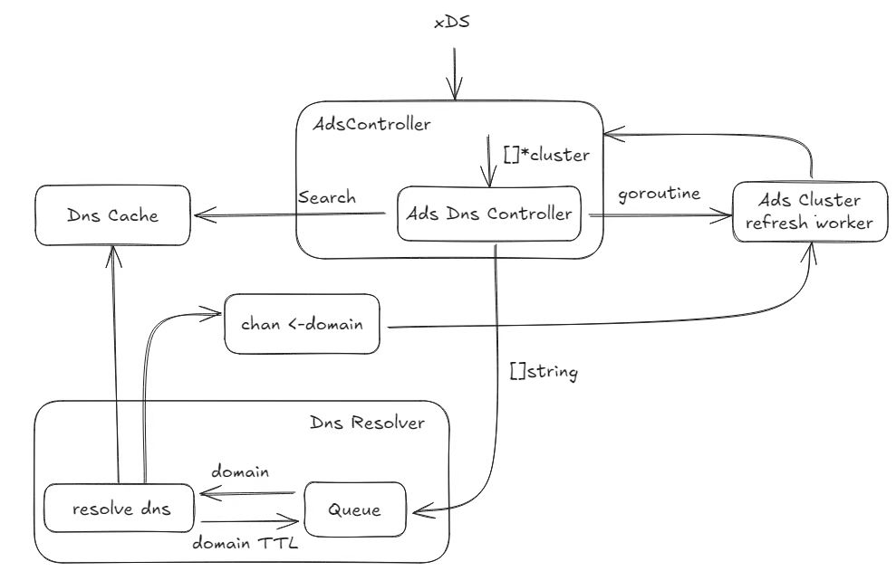
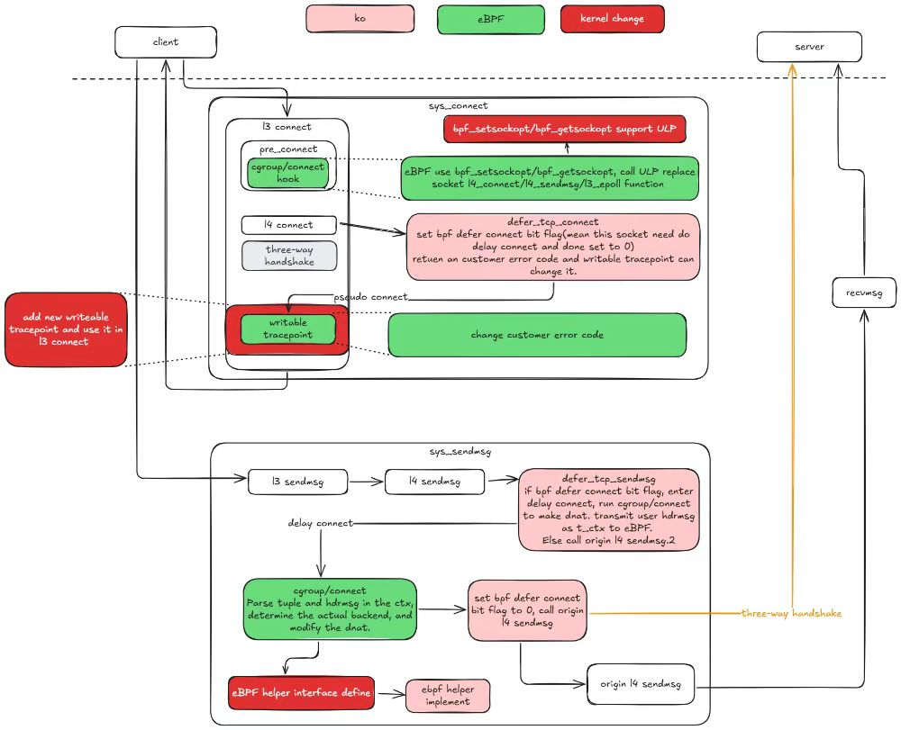

We are delighted to announce the release of ​​Kmesh v1.1.0​​, a milestone achieved through the collective efforts of our global community over the past three months. Special recognition goes to the contributors from the ​​LXF Project​​, whose dedication has been pivotal in driving this release forward.

Building on the foundation of v1.0.0, this release introduces significant enhancements to Kmesh’s architecture, observability, and ecosystem integration. The official Kmesh website has undergone a comprehensive redesign, offering an intuitive interface and streamlined documentation to empower both users and developers. Under the hood, we’ve refactored the DNS module and added metrics for long connections, providing deeper insights into more traffic patterns.

In Kernel-Native mode, we’ve reduced invasive kernel modifications. Also, we use global variables to replace the BPF config map to simplify the underlying complexity. Compatibility with ​​Istio 1.25​​ has been rigorously validated, ensuring seamless interoperability with the latest Istio version. Notably, the persistent TestKmeshRestart E2E test case flaky—a long-standing issue—has been resolved through long-term investigation and reconstruction of the underlying BPF program, marking a leap forward in runtime reliability.

## Main Features

### Website overhaul
The Kmesh official website has undergone a complete redesign, offering an intuitive user experience with improved documentation, reorganized content hierarchy and streamlined navigation. In addressing feedback from the previous iteration, we focused on key areas where user experience could be enhanced. The original interface presented some usability challenges that occasionally led to navigation difficulties. Our blog module in particular required attention, as its content organization and visual hierarchy impacted content discoverability and readability. From an engineering perspective, we recognized opportunities to improve the code structure through better component organization and more systematic styling approaches, as the existing implementation had grown complex to maintain over time.

To address these problems, we shifted to React with Docusaurus, a modern documentation framework that's much more developer-friendly. This allowed us to create modular components, eliminating redundant code through reusability. Docusaurus provides built-in navigation systems specifically designed for documentation and blogs, plus version-controlled documentation features. We've implemented multilingual support with both English and Chinese documentation, added advanced search functionality, and completely reorganized the content structure. The result is a dramatically improved experience that makes the Kmesh site more accessible and valuable for all users.

### Long connection metrics
Before this release, Kmesh provides access logs during termination and establishment of a TCP connection with more detailed information about the connection, such as bytes sent, received, packet lost, rtt and retransmits. Kmesh also provides workload and service specific metrics such as bytes sent and received, lost packets, minimum rtt, total connection opened and closed by a pod. These metrics are only updated after a connection is closed.

In this release, we implement access logs and metrics for TCP long connections, developing a continuous monitoring and reporting mechanism that captures detailed, real-time data throughout the lifetime of long-lived TCP connections. Access logs are reported periodically with information such as reporting time, connection establishment time, bytes sent, received, packet loss, rtt, retransmits and state. Metrics such as bytes sent and received, packet loss, retransmits are also reported periodically for long connections.

### DNS refactor
The current DNS process includes the CDS refresh process. As a result, DNS is deeply coupled with kernel-native mode and cannot be used in dual-engine mode.

In release 1.1 we refactored the DNS module of Kmesh. Instead of a structure containing cds, the data looped through the refresh queue in the Dns is now a domain, so that the Dns module no longer cares about the Kmesh mode, only providing the hostname to be resolved.

### BPF config map optimization
Kmesh has eliminated the dedicated kmesh_config_map BPF map, which previously stored global runtime configurations such as BPF logging level and monitoring toggle. These settings are now managed through global variables. Leveraging global variables simplifies BPF configuration management, enhancing runtime efficiency and maintainability.

Optimise Kernel Native mode to reduce intrusive modifications to the kernel
The kernel-native mode requires a large number of intrusive kernel reconstructions to implement HTTP-based traffic control. Some of these modifications may have a significant impact on the kernel, which makes the kernel-native mode difficult to deploy and use in a real production environment.
To resolve this problem, we have modified the kernel in kernel-native mode and the involved ko and eBPF synchronously. Through the optimization of this release. In kernel 5.10, the kernel modification is limited to four, and in kernel 6.6, the kernel modification is reduced to only one. This last one will be eliminated as much as possible, with the goal of eventually running kernel-native mode on native version 6.6 and above.

### Adopt istio 1.25
Kmesh has verified compatibility with istio 1.25 and has added the corresponding E2E test to CI. The Kmesh community maintains verification of the three istio versions in CI, so the E2E test of istio 1.22 has been removed from CI.

## Critical Bug Fix

kmeshctl install waypoint error ([#1287](https://github.com/kmesh-net/kmesh/issues/1287))

TestKmeshRestart flaky ([#1192](https://github.com/kmesh-net/kmesh/issues/1192))

TestServiceEntrySelectsWorkloadEntry flaky ([#1352](https://github.com/kmesh-net/kmesh/issues/1352))

## Acknowledgment

Kmesh v1.1.0 includes 118 commits from 14 contributors. We would like to express our sincere gratitude to all contributors:

|                |                  |              |             |
| -------------- | ---------------- | ------------ | ----------- |
| @hzxuzhonghu   | @LiZhenCheng9527 | @YaoZengzeng | @silenceper |
| @weli-l        | @sancppp         | @Kuromesi    | @yp969803   |
| @lec-bit       | @ravjot07        | @jayesh9747  | @harish2773 |
| @Dhiren-Mhatre | @Murdock9803     |              |             |

We have always developed Kmesh with an open and neutral attitude, and continue to build a benchmark solution for the Sidecarless service mesh industry, serving thousands of industries and promoting the healthy and orderly development of service mesh. Kmesh is currently in a stage of rapid development, and we sincerely invite people with lofty ideals to join us!

## Reference Links

Kmesh Release v1.1.0（https://github.com/kmesh-net/kmesh/releases/tag/v1.1.0）
Kmesh GitHub（https://github.com/kmesh-net/kmesh）
Kmesh Website（https://kmesh.net/）

