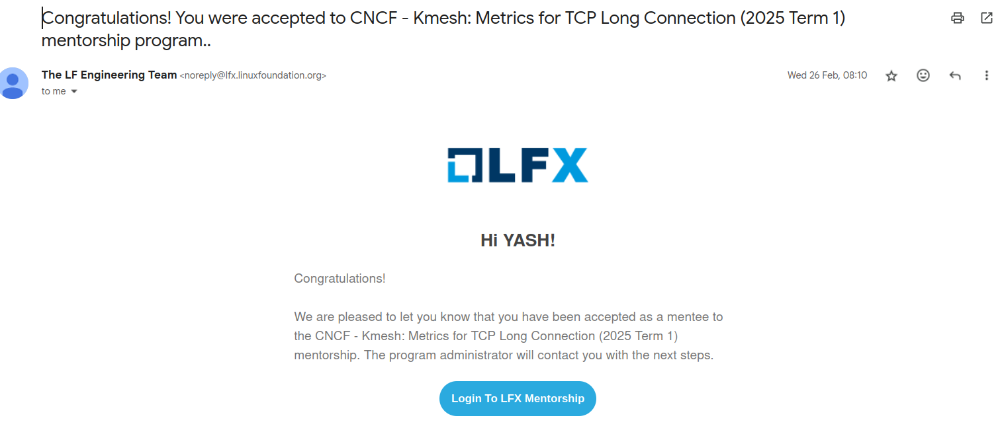

## Introduction

I successfully completed my mentorship with Kmesh during the LFX 2025 Term-1 program, which was an enriching and invaluable experience. Over the past three months, I gained significant knowledge and hands-on experience while contributing to the project. In this blog, I’ve documented my mentorship journey and the work I accomplished as a mentee.

## LFX Mentorship Program – Overview

The LFX Mentorship Program, run by the Linux Foundation, is designed to help students and early-career professionals gain hands-on experience in open source development by working on real-world projects under the guidance of experienced mentors

Participants contribute to high-impact projects hosted by foundations like CNCF, LF AI, LF Edge, and more. The program typically runs in 3 terms throughout the year, each lasting about three months.

[More-info](https://mentorship.lfx.linuxfoundation.org/#projects_all)

## My Acceptance

I am a regular opensource contributor and loves contributing to opensource. My interests heavily aligned with clound-native technologies. I was familiar with popular mentorship programs like LFX and GSoC, which are designed to help students get started in the open source world. 
Based on my work the Kmesh community also promoted for the member of Kmesh
I had made up my mind to apply for LFX 2025 Term-1 and began exploring projects in early February. The projects under CNCF for LFX are listed in the [cncf/mentoring](https://github.com/cncf/mentoring) GitHub repository. I came across the [Kmesh](https://github.com/kmesh-net/kmesh) project, a newly added CNCF sandbox project participating in LFX for the first time. 
I found the Kmesh project particularly exciting because of the problem it addresses—providing a sidecarless service mesh data plane. This approach can greatly benefit the community by improving performance and reducing overhead.

Kmesh came up with 4 projects in term-1, i selected [long-connection-metrics](https://github.com/kmesh-net/kmesh/issues/1211) projects as it allows me to works with eBPF a already have a prior experience on working with eBPF.

I began exploring the Kmesh project by reading the documentation and contributing to Good First Issues. As I became more involved, the mentors started to take notice. I also submitted a [proposal](https://github.com/kmesh-net/kmesh/blob/main/docs/proposal/tcp_long_connection_metrics.md) for the long connection metrics project.

In late February, I received an email from LFX notifying me of my selection.

## Project Workthrough

The `tcp long connection metrics` project aims to implement access logs and metrics for TCP long connections, developing a continuous monitoring and reporting mechanisms that captures detailed, real-time data throughout the lifetime of long-lived TCP connections.

Ebpf hooks are used to collect connection stats such as send/received bytes, packets losts, retransmissions etc.

[More-information](https://kmesh.net/docs/transpot-layer/l4-metrics)

## Mentorship Experience

The Kmesh maintainers were always available to help me with any doubts, whether on Slack or GitHub. Additionally, there is a community meeting held regularly every Thursday, where I could ask questions and discuss various topics. I’ve learned a lot from them, including how to approach problems effectively and consider edge cases during development in these three months.

Based on my contributions and active involvement, the Kmesh community recognized my efforts and promoted me to a member of the organization. This acknowledgment was truly encouraging and motivated me to continue contributing to Kmesh and help the project grow.
