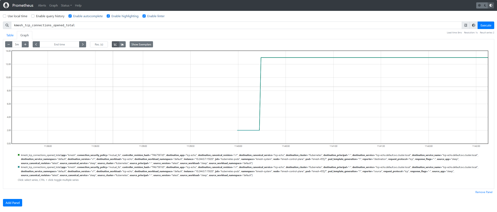

## Preparation

### 1. Install Kmesh

Please refer to the [quickstart guide](/docs/setup/quick-start.md)

> **Note:** The following should be added to the Kmesh annotation:
>
> ```yaml
> annotations:
>   prometheus.io/path: "status/metric"
>   prometheus.io/port: "15020"
>   prometheus.io/scrape: "true"
> ```

### 2. Configure Kmesh to manage the `default` namespace

```bash
kubectl label namespace default istio.io/dataplane-mode=Kmesh
```

Expected output:

```
namespace/default labeled
```

### 3. Install the Prometheus Addon

Istio provides a basic sample installation to quickly get Prometheus up and running:

```bash
kubectl apply -f https://raw.githubusercontent.com/kmesh-net/kmesh/main/samples/addons/prometheus.yaml
```

### 4. Deploy the tcp-echo and sleep applications

```bash
# Deploy tcp-echo application
kubectl apply -f https://raw.githubusercontent.com/kmesh-net/kmesh/main/samples/tcp-echo/tcp-echo.yaml

# Deploy sleep application
kubectl apply -f https://raw.githubusercontent.com/kmesh-net/kmesh/main/samples/sleep/sleep.yaml

# Verify deployments
kubectl get po -A
```

Expected output:

```
NAMESPACE            NAME                                          READY   STATUS    RESTARTS   AGE
default              sleep-bc9998558-pbfvk                         1/1     Running   0          7m
default              tcp-echo-7f676db574-mzmql                     1/1     Running   0          7m
```

> **Important:** Confirm that sleep and tcp-echo are indeed [managed by kmesh](/docs/setup/quick-start.md#deploy-the-sample-applications).

### 5. Enable required metrics

Kmesh prometheus metrics can be enabled and disabled using kmeshctl.
Please refer to the [kmeshctl Guide](../developer-guide/Kmeshctl-usage/kmeshctl-monitoring.md)

## Querying Metrics from Prometheus

### Available Metrics

Metrics monitored by Kmesh L4 at this stage:

#### Workload Metrics
Give information about traffic behavior and performance between workloads.

| Name                                           | Description                                                                                    |
| ---------------------------------------------- | ---------------------------------------------------------------------------------------------- |
| `kmesh_tcp_workload_connections_opened_total`  | The total number of TCP connections opened to a workload                                       |
| `kmesh_tcp_workload_connections_closed_total`  | The total number of TCP connections closed to a workload                                       |
| `kmesh_tcp_workload_received_bytes_total`      | The size of the total number of bytes received in response to a workload over a TCP connection |
| `kmesh_tcp_workload_sent_bytes_total`          | The size of the total number of bytes sent in response to a workload over a TCP connection     |
| `kmesh_tcp_workload_conntections_failed_total` | The total number of TCP connections failed to a workload                                       |
| `kmesh_tcp_retrans_total`      | Total number of retransmissions of the workload over the TCP connection |
| `kmesh_tcp_packet_loss_total`          | Total number of TCP packets lost between source and destination workload     |

#### Service Metrics
Give information about traffic behavior and performance between services.

| Name                                  | Description                                                                                   |
| ------------------------------------- | --------------------------------------------------------------------------------------------- |
| `kmesh_tcp_connections_opened_total`  | The total number of TCP connections opened to a service                                       |
| `kmesh_tcp_connections_closed_total`  | The total number of TCP connections closed to a service                                       |
| `kmesh_tcp_received_bytes_total`      | The size of the total number of bytes received in response to a service over a TCP connection |
| `kmesh_tcp_sent_bytes_total`          | The size of the total number of bytes sent in response to a service over a TCP connection     |
| `kmesh_tcp_conntections_failed_total` | The total number of TCP connections failed to a service                                       |

#### Connection Metrics
Give information about traffic behavior and performance of a established tcp connection(duration > 5 seconds). These metrics are particularly valuable in clusters running workloads that establish long-lived TCP connections, such as databases, message brokers, audio/video streaming services, AI applications etc. 
It is recommended to set the scrape interval to 5 seconds to ensure connection metrics are reliably captured.

| Name                                           | Description                                                                                    |
| ---------------------------------------------- | ---------------------------------------------------------------------------------------------- |
| `kmesh_tcp_connection_sent_bytes_total`  | The total number of bytes sent over established TCP connection                                       |
| `kmesh_tcp_connection_received_bytes_total`  | The total number of bytes received over established TCP connection                                       |
| `kmesh_tcp_connection_packet_lost_total`      | Total number of packets lost during transmission in a TCP connection                                       |
| `kmesh_tcp_connection_retrans_total`          | The total number of retransmits over established TCP connection                                       |

### Querying Steps

Here's how to view these metrics through Prometheus:

#### 1. Verify that the Prometheus service is running in your cluster

In Kubernetes environment, execute the following command:

```bash
kubectl -n kmesh-system get svc prometheus
```

Expected output:

```
NAME         TYPE        CLUSTER-IP     EXTERNAL-IP   PORT(S)    AGE
prometheus   ClusterIP   10.96.18.252   <none>        9090/TCP   24h
```

#### 2. Establish a TCP connection between applications in the mesh

Create a TCP link between `sleep` and `tcp-echo` with the `nc` command:

```bash
kubectl exec "$(kubectl get pod -l app=sleep -o jsonpath={.items..metadata.name})" \
  -c sleep -- sh -c 'echo "port 9000" | nc tcp-echo 9000' | grep "hello" && \
  echo 'connection succeeded' || echo 'connection rejected'
```

Expected output:

```
hello port 9000
connection succeeded
```

#### 3. Open the Prometheus UI

Use the port-forward command to forward the traffic to Prometheus:

```bash
kubectl port-forward --address 0.0.0.0 svc/prometheus 9090:9090 -n kmesh-system
```

Expected output:

```
Forwarding from 0.0.0.0:9090 -> 9090
Handling connection for 9090
Handling connection for 9090
```

#### 4. Execute a Prometheus query

In the "Expression" input box at the top of the web page, enter the text:

```
kmesh_tcp_connections_opened_total
```

The results will be similar to:


You can also see the query results graphically by selecting the Graph tab underneath the Execute button.



## Cleanup

1. Disable port-forward.

2. Cleanup Prometheus:

```bash
kubectl delete -f https://raw.githubusercontent.com/kmesh-net/kmesh/main/samples/addons/prometheus.yaml
```

If you are not planning to explore any follow-on tasks, refer to the [quickstart cleanup](/docs/setup/quick-start.md#clean-up) instructions to shutdown the application.
