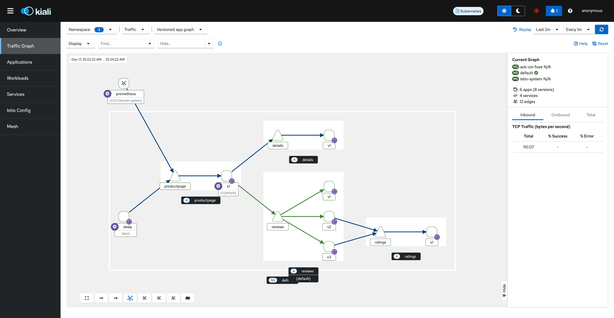

## 准备工作

1. **使默认命名空间由 Kmesh 管理。**

2. **部署 bookinfo 作为示例应用程序，并部署 sleep 作为 curl 客户端。**

3. **[可选] 为服务 `reviews` 安装服务粒度的 waypoint。**  
   _以上步骤可参考 [安装 Waypoint | Kmesh](/i18n/zh/docusaurus-plugin-content-docs/current/application-layer/install_waypoint.md#准备工作)。在安装 Istio 时，我们建议安装 Istio 的 ambient 模式，而不是仅安装 Istiod，因为 Kiali 目前依赖 Istio 组件才能正常工作。_

4. **部署 Prometheus 来记录 Kmesh 指标，并将其转换为 Istio 标准指标。**  
   _此 Prometheus 插件利用 Prometheus 记录规则和重新标记配置，将 Kmesh 的 L4 指标转换为 Istio 标准指标，以便 Kiali 能够可视化这些指标。_

   ```bash
   kubectl apply -f https://raw.githubusercontent.com/kmesh-net/kmesh/main/samples/addons/prometheus_recording_istio.yaml
   ```

5. **部署 Kiali，从 Prometheus 读取指标。**

   ```bash
   kubectl apply -f https://raw.githubusercontent.com/kmesh-net/kmesh/main/samples/addons/kiali.yaml
   ```

## 在网格中的应用程序之间生成一些持续的流量

```bash
kubectl exec deploy/sleep -- sh -c "while true; do curl -s http://productpage:9080/productpage | grep reviews-v.-; sleep 1; done"
```

## 使用 Kiali 可视化服务的流量图

1. **使用 port-forward 命令将流量转发到 Kiali。**

   ```bash
   kubectl port-forward --address 0.0.0.0 svc/kiali 20001:20001 -n kmesh-system
   Forwarding from 0.0.0.0:20001 -> 20001
   ```

2. **从浏览器查看 Kiali 中的流量图。**  
   访问 `Traffic Graph` 面板。在左侧顶部选择 `default` 命名空间。  
     
   _在此流量拓扑图中，蓝色线条代表 TCP 流量，由 Kmesh 代理，而绿色线条代表 HTTP 流量，由 Waypoint 代理。有关 Kiali 流量拓扑图的更多信息，请参阅 [Kiali 文档](https://kiali.io/docs/features/topology/)。_

## 清理

1. **移除 Prometheus 和 Grafana：**

   ```bash
   kubectl delete -f https://raw.githubusercontent.com/kmesh-net/kmesh/main/samples/addons/prometheus_recording_istio.yaml
   kubectl delete -f https://raw.githubusercontent.com/kmesh-net/kmesh/main/samples/addons/kiali.yaml
   ```

2. **如果您不打算探索任何后续任务，请参考 [安装 Waypoint/清理](/i18n/zh/docusaurus-plugin-content-docs/current/application-layer/install_waypoint.md#清理) 说明来移除 waypoint 并关闭应用程序。**

---

This translation ensures that the document is accessible to Chinese-speaking users while maintaining the technical integrity of the original content.
