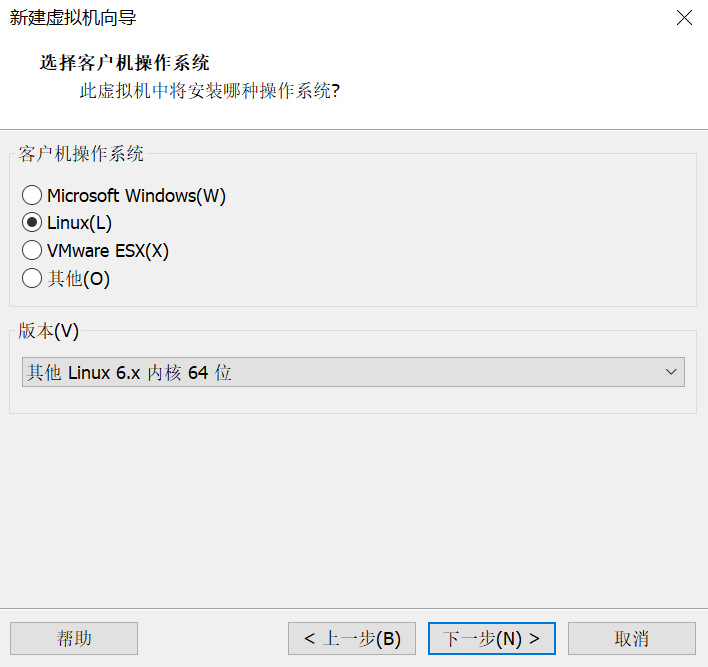

--- 
title: 使用增强内核 
sidebar_position: 3 
---

# 使用增强内核

Kmesh 的某些功能依赖于增强内核（例如，ads 模式下的 L7 流量控制）。要使用它，您可以使用**openEuler 23.03**，它原生支持所有功能。

您可以按照以下步骤使用增强内核：

## 下载 openEuler 23.03 镜像

从以下链接下载镜像：<https://repo.openeuler.org/openEuler-23.03/ISO/>

## 安装操作系统

这里，我们以 [VMware](https://www.vmware.com/products/workstation-pro/html.html) 为例（您也可以使用其他虚拟机管理工具）。



> **注意：** **openEuler 23.03** 的内核版本是 **6.1.19**。因此您应该选择 **其他 Linux 6.x 内核 64 位** (**Linux 6.x kernel 64bit**)。

然后，您可以按照[官方博客](https://www.openeuler.org/zh/blog/20240306vmware/20240306vmware.html)进行安装。

## 安装内核头文件

Kmesh 根据一些内核头文件（例如 `bpf.h`）来确定是否使用增强内核。因此，您应该通过以下方式安装内核头文件：

```shell
yum install kernel-headers
```

然后，您应该能够在路径 `/usr/include/linux` 中找到内核头文件。

## 检查您是否准备好使用增强内核

```shell
grep -q "FN(parse_header_msg)" /usr/include/linux/bpf.h && echo "enhanced" || echo "unenhanced"
```

现在您可以按照[部署和开发指南](/i18n/zh/docusaurus-plugin-content-docs/current/setup/develop-with-kind.md)来探索 kmesh 的全部功能。
